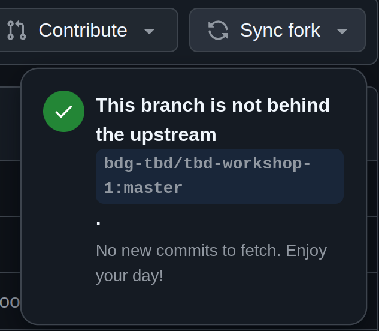
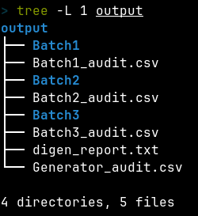
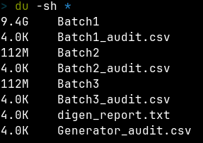
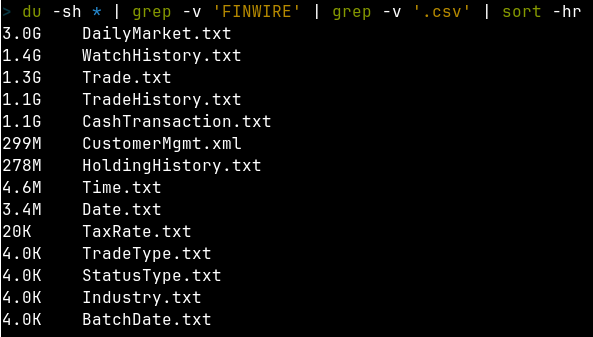

IMPORTANT ❗ ❗ ❗ Please remember to destroy all the resources after each work session. You can recreate infrastructure by creating new PR and merging it to master.


0. The goal of this phase is to create infrastructure, perform benchmarking/scalability tests of sample three-tier lakehouse solution and analyze the results using:
* [TPC-DI benchmark](https://www.tpc.org/tpcdi/)
* [dbt - data transformation tool](https://www.getdbt.com/)
* [GCP Composer - managed Apache Airflow](https://cloud.google.com/composer?hl=pl)
* [GCP Dataproc - managed Apache Spark](https://spark.apache.org/)
* [GCP Vertex AI Workbench - managed JupyterLab](https://cloud.google.com/vertex-ai-notebooks?hl=pl)

Worth to read:
* https://docs.getdbt.com/docs/introduction
* https://airflow.apache.org/docs/apache-airflow/stable/index.html
* https://spark.apache.org/docs/latest/api/python/index.html
* https://medium.com/snowflake/loading-the-tpc-di-benchmark-dataset-into-snowflake-96011e2c26cf
* https://www.databricks.com/blog/2023/04/14/how-we-performed-etl-one-billion-records-under-1-delta-live-tables.html


2. Authors:

   ***Enter your group nr***

   DONE:
   Team 4

   ***Link to forked repo***

   DONE:
   [https://github.com/karolstepanienko/tbd-workshop-1](https://github.com/karolstepanienko/tbd-workshop-1)


3. Sync your repo with https://github.com/bdg-tbd/tbd-workshop-1.

   DONE: sync was not necessary:
   


4. Provision your infrastructure.

    a) setup Vertex AI Workbench `pyspark` kernel as described in point [8](https://github.com/bdg-tbd/tbd-workshop-1/tree/v1.0.32#project-setup)

    b) upload [tpc-di-setup.ipynb](https://github.com/bdg-tbd/tbd-workshop-1/blob/v1.0.36/notebooks/tpc-di-setup.ipynb) to the running instance of your Vertex AI Workbench


5. In `tpc-di-setup.ipynb` modify cell under section ***Clone tbd-tpc-di repo***:

   a)first, fork https://github.com/mwiewior/tbd-tpc-di.git to your github organization.

   DONE:
   [https://github.com/karolstepanienko/tbd-tpc-di](https://github.com/karolstepanienko/tbd-tpc-di)

   b)create new branch (e.g. 'notebook') in your fork of tbd-tpc-di and modify profiles.yaml by commenting following lines:
   ```  
        #"spark.driver.port": "30000"
        #"spark.blockManager.port": "30001"
        #"spark.driver.host": "10.11.0.5"  #FIXME: Result of the command (kubectl get nodes -o json |  jq -r '.items[0].status.addresses[0].address')
        #"spark.driver.bindAddress": "0.0.0.0"
   ```
   This lines are required to run dbt on airflow but have to be commented while running dbt in notebook.

   DONE in:
   [d949851](https://github.com/karolstepanienko/tbd-tpc-di/commit/d949851299633ffa68745d40ec05a44ec46e7602)

   c)update git clone command to point to ***your fork***.

   DONE in:
   [f767210](https://github.com/karolstepanienko/tbd-workshop-1/commit/f7672107a56d1a5bab90fa89fc348ef061e9ca1f)


6. Access Vertex AI Workbench and run cell by cell notebook `tpc-di-setup.ipynb`.

   a) in the first cell of the notebook replace: `%env DATA_BUCKET=tbd-2023z-9910-data` with your data bucket.

   DONE in:
   [9cc64d6](https://github.com/karolstepanienko/tbd-workshop-1/commit/9cc64d685c9299d35e06d8e9f505d4b4a3a6d837)

   b) in the cell:
         ```%%bash
         mkdir -p git && cd git
         git clone https://github.com/mwiewior/tbd-tpc-di.git
         cd tbd-tpc-di
         git pull
         ```
      replace repo with your fork. Next checkout to 'notebook' branch.

   DONE in:
   [f767210](https://github.com/karolstepanienko/tbd-workshop-1/commit/f7672107a56d1a5bab90fa89fc348ef061e9ca1f)

   c) after running first cells your fork of `tbd-tpc-di` repository will be cloned into Vertex AI  environment (see git folder).

   d) take a look on `git/tbd-tpc-di/profiles.yaml`. This file includes Spark parameters that can be changed if you need to increase the number of executors and
  ```
   server_side_parameters:
       "spark.driver.memory": "2g"
       "spark.executor.memory": "4g"
       "spark.executor.instances": "2"
       "spark.hadoop.hive.metastore.warehouse.dir": "hdfs:///user/hive/warehouse/"
  ```


7. Explore files created by generator and describe them, including format, content, total size.

   ***Files description***

   Data Generation utility for TPC-DI benchmark was invoked with the following command:
   ```bash
   java -jar DIGen.jar -sf 100 -o /tmp/tpc-di
   ```
   This generated around 9.6 GiB of data files. Generation process is very CPU dependant and the time of generation can be lowered to less than a minute on a system with a faster CPU.

   Generator summarises generated records:
   `AuditTotalRecordsSummaryWriter - TotalRecords all Batches: 162228471 3891210.84 records/second`

   Top level generated file structure:
   

   Sizes of folders with generated data:
   
   Majority of generated data is stored in the `Batch1` folder. Taking a closer look at the contents of this folder, it's quite obvious that majority of the generated data is related to various trades performed in a specified period of time. Biggest files store trading history:
   
   Folder `Batch1` stores also 203 `FINWIRE<year><quarter>` (from 1967Q1 to 2017Q3) files totalling around 1.1G.

   Generated data is separated (in dedicated .txt or .csv files) from metadata in .csv files with a matching name that describes the generation process.

   Some of the generated data files:
   
   CashTransaction.txt:
      - Column names: CT_CA_ID, CT_DTS, CT_AMT, CT_NAME
      - content: transaction ID, date, amount of money spent, transaction name
      - separator: `|`
   CustomerMgmt.xml:
      - content: a collection of customers data including names, address, contact info, tax info, and account
   DailyMarket.txt:
      - column names: DM_DATE, DM_S_SYMB, DM_CLOSE, DM_HIGH, DM_LOW, DM_VOL
      - content: clearly financial data describing stock prices at a given day
      - separator: `|`

   In summary generated files have heavily varied contents saved in various different file formats. Truly a challenging dataset to analyse, which explains the need of data transformation tool like `dbt`.

8. Analyze tpcdi.py. What happened in the loading stage?

   ***Your answer***

   `tpcdi.py` is a script that loads data from files generated locally by a TPC-DI benchmark generator (DIGen.jar) into a remotely accessible Data Lakehouse.

   Steps executed in the file:
   1. Creating a connection to Apache Hive data warehouse system.
   2. Create necessary databases:
   ```Python
   ['digen', 'bronze', 'silver', 'gold']
   ```
   3. Run `load_csv` method for each data file, which creates a table from a CSV file.
   4. Data from FINWIRE files is not loaded directly all to one table, instead selected subsets of columns from those files are loaded to three dedicated tables: cmp, sec, fin. This is accomplished using a temporary view 'finwire'.

   Created data structure uses the Medallion architecture, with 4 databases where data quality and usefulness increases in each consecutive database.

9. Using SparkSQL answer: how many table were created in each layer?

   ***SparkSQL command and output***

   ```Python
   databases = spark.sql("show databases").collect()
   layers = [db.namespace for db in databases]
   for layer in layers:
      spark.sql(f"use {layer}")
      table_count = spark.sql("show tables").count()
      print(f"Layer {layer} has {table_count} tables.")
   ```

   TODO output

10. Add some 3 more [dbt tests](https://docs.getdbt.com/docs/build/tests) and explain what you are testing.

   ***Add new tests to your repository.***

   DONE in:
   [589e6fe](https://github.com/karolstepanienko/tbd-tpc-di/commit/589e6fe621381eb57237d3d3344fb0d4d8d61e14)

   ***Code and description of your tests***

   `test_dates.sql`: Detects erroneous records where removal happened before creation.
   ```SQL
   select
      sk_date_placed,
      sk_date_removed
   from {{ ref('fact_watches') }}
   where sk_date_placed > sk_date_removed
   ```

   `test_tax_values.sql`: Detects records where tax value was negative.
   ```SQL
   select
      tax
   from {{ ref('trades') }}
   where tax < 0
   ```

   `test_week_day_names.sql`: Detects records where day of week name was not in an allowed set.
   ```SQL
   select
      day_of_week_desc
   from {{ ref('dim_date') }}
   where day_of_week_desc not in ('Monday', 'Tuesday', 'Wednesday', 'Thursday', 'Friday', 'Saturday', 'Sunday')
   ```

11. In main.tf update
   ```
   dbt_git_repo            = "https://github.com/mwiewior/tbd-tpc-di.git"
   dbt_git_repo_branch     = "main"
   ```
   so dbt_git_repo points to your fork of tbd-tpc-di.

   DONE in:
   [2be45f0](https://github.com/karolstepanienko/tbd-workshop-1/commit/2be45f054fe7b54aa2975924d4845d25ddc06540)

12. Redeploy infrastructure and check if the DAG finished with no errors:

***The screenshot of Apache Aiflow UI***
