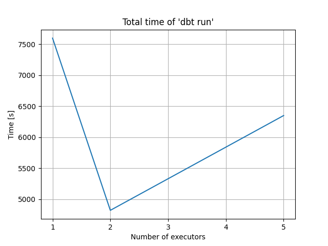

0. The goal of phase 2b is to perform benchmarking/scalability tests of sample three-tier lakehouse solution.


1. In main.tf, change machine_type at:

```
module "dataproc" {
  depends_on   = [module.vpc]
  source       = "github.com/bdg-tbd/tbd-workshop-1.git?ref=v1.0.36/modules/dataproc"
  project_name = var.project_name
  region       = var.region
  subnet       = module.vpc.subnets[local.notebook_subnet_id].id
  machine_type = "e2-standard-2"
}
```

and substitute "e2-standard-2" with "e2-standard-4".

  DONE in:
  [d6fa720](https://github.com/karolstepanienko/tbd-workshop-1/commit/d6fa720c4a2fd6991b32c6f338b775a7d031099f)

  For this test Composer is not necessary. In order to save costs it was removed from terraform configuration.

  DONE in:
  [9f7e550](https://github.com/karolstepanienko/tbd-workshop-1/commit/9f7e550e030a9456a8a7e8954dcfce620d8bb4ff)


2. If needed request to increase cpu quotas (e.g. to 30 CPUs): 
https://console.cloud.google.com/apis/api/compute.googleapis.com/quotas?project=tbd-2023z-9918

  DONE:
  

  Increasing CPU quotas is necessary only sometimes necessary due to Composer v2 using GKE autopilot. Number of CPU cores in that K8s cluster can sometimes be larger than necessary, which hits the quota.


3. Using tbd-tpc-di notebook perform dbt run with different number of executors, i.e., 1, 2, and 5, by changing:
```
 "spark.executor.instances": "2"
```

in profiles.yml.


  DONE comments:

  'Load staging' phase has to be performed before each test, otherwise dbt run will fail.

  This step calls only for changing the number of Spark executor instances, but much better results can be achieved if the number of dataproc worker nodes is also increased alongside the number of Spark executors. Because of this one additional test was performed with 5 dataproc worker nodes and a matching amount of Spark executor instances.


4. In the notebook, collect console output from dbt run, then parse it and retrieve total execution time and execution times of processing each model. Save the results from each number of executors.

DONE test results in a table:

| model | 2n_e1 | 2n_e2 | 2n_e5 | 5n_e5 |
| -------- | ----- | ----- | ----- | ----- |
| demo_bronze.brokerage_cash_transaction | 43.32 | 29.38 | 31.6 | 20.03 |
| demo_bronze.brokerage_daily_market | 148.09 | 68.61 | 56.14 | 37.55 |
| demo_bronze.brokerage_holding_history | 13.88 | 10.3 | 7.73 | 10.47 |
| demo_bronze.brokerage_trade | 74.21 | 39.95 | 26.36 | 28.49 |
| demo_bronze.brokerage_trade_history | 58.03 | 37.74 | 24.94 | 24.79 |
| demo_bronze.brokerage_watch_history | 71.15 | 45.51 | 25.91 | 26.99 |
| demo_bronze.crm_customer_mgmt | 10.0 | 6.5 | 6.6 | 6.25 |
| demo_bronze.finwire_company | 2.83 | 2.23 | 1.83 | 1.63 |
| demo_bronze.finwire_financial | 86.53 | 43.85 | 35.6 | 30.57 |
| demo_bronze.finwire_security | 2.67 | 1.94 | 2.67 | 2.04 |
| demo_bronze.hr_employee | 2.98 | 2.67 | 4.96 | 1.82 |
| demo_bronze.reference_date | 1.3 | 1.35 | 1.89 | 1.17 |
| demo_bronze.reference_industry | 0.88 | 0.94 | 1.33 | 0.79 |
| demo_bronze.reference_status_type | 0.75 | 0.87 | 1.02 | 0.8 |
| demo_bronze.reference_tax_rate | 0.7 | 0.87 | 0.9 | 1.04 |
| demo_bronze.reference_trade_type | 0.78 | 0.95 | 0.88 | 0.8 |
| demo_bronze.syndicated_prospect | 5.59 | 4.46 | 3.96 | 2.99 |
| demo_silver.daily_market | 2196.85 | 1045.27 | 688.85 | 506.48 |
| demo_silver.employees | 3.74 | 3.23 | 6.5 | 2.43 |
| demo_silver.date | 1.61 | 1.58 | 4.44 | 1.36 |
| demo_silver.companies | 6.96 | 6.03 | 12.7 | 4.51 |
| demo_silver.accounts | 13.74 | 9.77 | 22.17 | 8.55 |
| demo_silver.customers | 11.12 | 8.22 | 11.14 | 5.87 |
| demo_silver.trades_history | 481.03 | 368.24 | 701.47 | 135.55 |
| demo_gold.dim_broker | 5.98 | 8.8 | 5.9 | 2.24 |
| demo_gold.dim_date | 1.48 | 2.66 | 1.67 | 1.08 |
| demo_gold.dim_company | 2.78 | 6.68 | 6.29 | 2.32 |
| demo_silver.financials | 99.63 | 102.93 | 154.63 | 41.12 |
| demo_silver.securities | 5.8 | 13.82 | 8.63 | 3.64 |
| demo_silver.cash_transactions | 73.07 | 111.32 | 146.57 | 25.2 |
| demo_gold.dim_customer | 18.88 | 27.56 | 37.99 | 10.52 |
| demo_gold.dim_trade | 295.5 | 324.97 | 564.93 | 78.13 |
| demo_silver.trades | 369.05 | 284.21 | 558.21 | 104.05 |
| demo_gold.dim_security | 4.53 | 5.39 | 5.07 | 2.94 |
| demo_silver.watches_history | 154.68 | 279.73 | 404.21 | 54.69 |
| demo_gold.dim_account | 13.36 | 19.2 | 19.71 | 6.46 |
| demo_silver.holdings_history | 175.31 | 127.75 | 194.06 | 41.42 |
| demo_silver.watches | 230.04 | 274.31 | 310.33 | 64.66 |
| demo_gold.fact_cash_transactions | 78.9 | 138.31 | 222.33 | 26.31 |
| demo_gold.fact_trade | 678.11 | 267.45 | 526.65 | 66.27 |
| demo_gold.fact_holdings | 1408.62 | 640.55 | 1016.27 | 119.47 |
| demo_gold.fact_watches | 494.07 | 288.16 | 259.19 | 25.93 |
| demo_gold.fact_cash_balances | 248.83 | 155.06 | 224.23 | 28.82 |
| total time | 7597.36 | 4819.32 | 6348.46 | 1568.24 |


5. Analyze the performance and scalability of execution times of each model. Visualize and discuss the final results.

  
  

  For two nodes the lowest processing time was achieved for exactly two executors, one executor for every node. Adding more executors (5) resulted in a much higher time than wen using 2 executors, which is worse. With 5 executors Spark unnecessarily divided the workload into smaller portions which then competed on those two nodes for resources (one node with two executors and another with three). This resulted in a much more chaotic environment that Spark struggled to properly utilise. Therefore number of executors in a cluster used by Spark should match the number of available worker nodes. That way available resources will be optimally utilised. For further decreases in the data processing time, more infrastructure is necessary.

  In order to check if further performance increase is possible (if the task can be successfully divided into smaller calculations) another test with 5 worker nodes in dataproc cluster and 5 Spark executors with a higher memory constraint ("spark.executor.memory": "12g") was performed. This test was a success from the processing time perspective because it achieved 67.46% (~26min) faster execution than the two node test (~80min).

  According to [cloudprice.net](https://cloudprice.net/gcp/compute?_ProcessorVCPUCount_min=2&sortField=PricePerHour&sortOrder=true&_MemorySizeInMB_max=16&_MemorySizeInMB_min=8) hourly cost of a e2-standard-4 VM is around 0.1474 USD. That means running 2 VMs for this calculation generated costs: 2 * 0.1474 * 80/60 ~= 0.393 USD, while running 5 VMs generated costs: 5 * 0.1474 * 26/60 ~= 0.32 USD. This shows that running more VMs turned out to be CHEAPER in the end. Assumption is necessary that calculations are sufficiently long where creation and destruction of terraform resources will generate negligible costs. Approach with more VMs also saves dev man-hour time which is also usually expensive.

  

  When analysing processing times for each table model for various numbers of nodes and executors it's hard to find a definitive pattern that would describe relation between number of executors (and nodes) and processing time. In majority of cases relation is the same as on the total processing time, but there are some exceptions, like `demo_silver.watches_history` which was much faster when executed on a single executor than on two executors. This task could be an exceptionally hard one for Spark to divide efficiently therefore it's execution on a single executor was faster.

  

  5 nodes and 5 executors is almost always the fastest approach, with only a single table model `demo_bronze.brokerage_holding_history` being an exception. It's to be expected because this approach joins the most amount of processing power with the easiest environment for Spark to distribute workloads.
